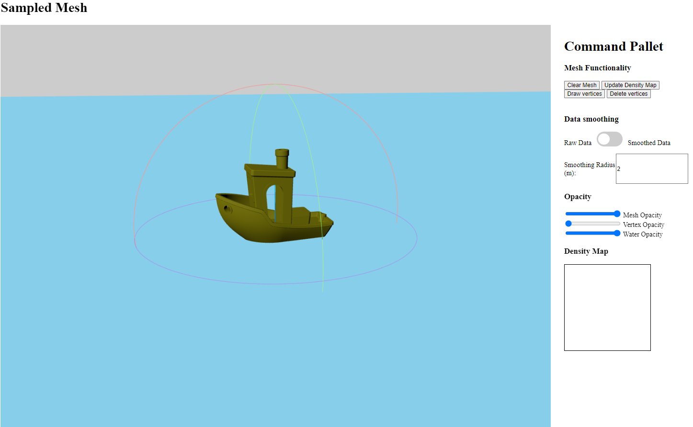
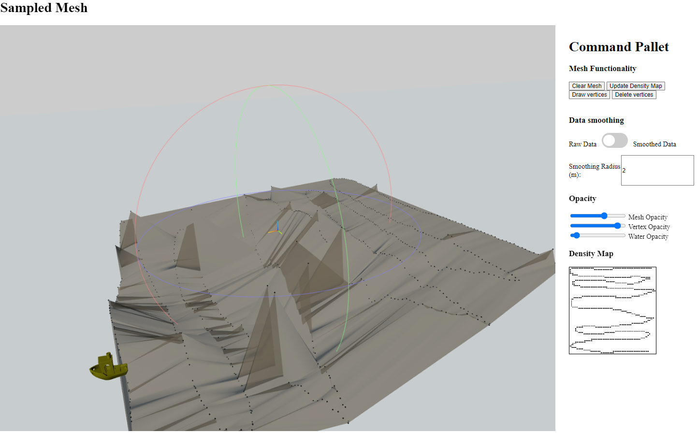
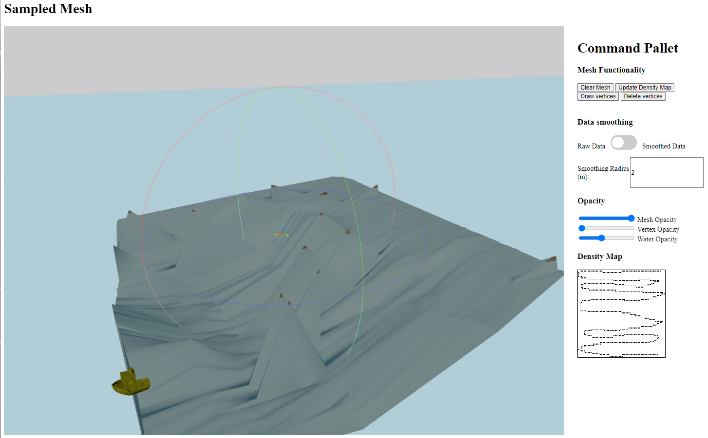
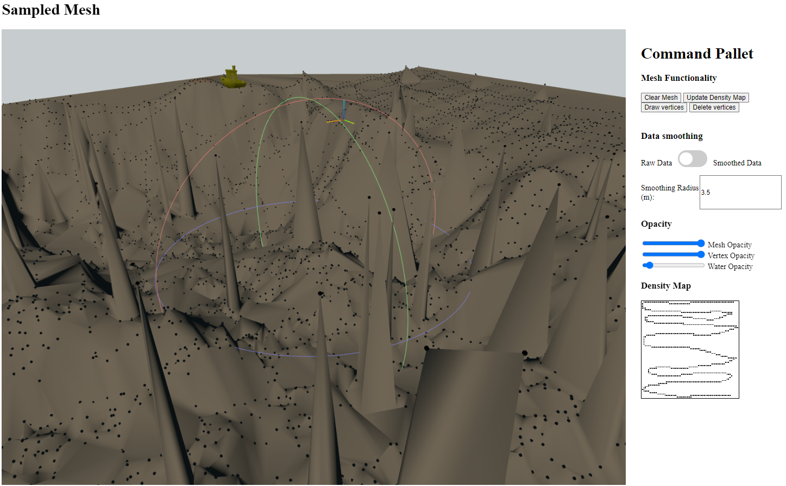
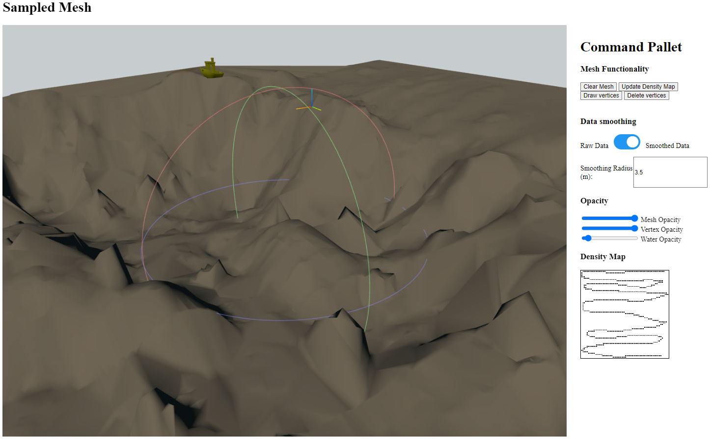
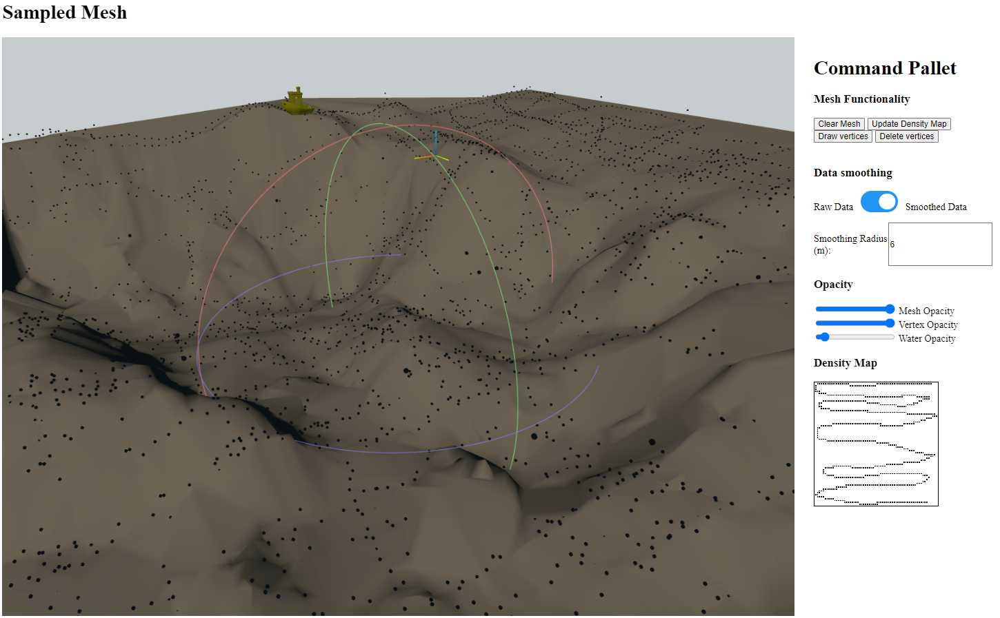

# Bathymetric Visualizer
[](https://www.python.org)


[](https://github.com/matthew-buglass/bathymetric_visualizer/actions/workflows/python-test.yml)
[](https://github.com/matthew-buglass/bathymetric_visualizer/actions/workflows/python-lint.yml)

[//]: # (![Test Coverage]&#40;https://img.shields.io/endpoint?url=https://gist.githubusercontent.com/matthew-buglass/b88855f7e79729fc1cf9bd4b582012ba/raw/covbadge.json&#41;)

A webapp the dynamically visualizes bathymetry as sample points are being collected. Code documentation can be found 
[here](https://matthew-buglass.github.io/bathymetric_visualizer/) (note it is still incomplete). Currently, 
the visualizer only tracks one global sample mesh, which is lost when the app restarts. Future efforts will include 
containerization and database backing for easier portability and data persistence. This application's API is compatible
with the endpoint upload of [this simulator](https://github.com/matthew-buglass/echo_sounding_simulator).

## Running the App
There are two provided scripts to prepare your environment to run the application. Running `./install.sh` will install
both Python and Node dependencies and running `./run.sh` will start the app. For convenience that commands are:

```shell
# install dependencies
pip install -r requirements.txt
npm install

# build webpack
npx webpack --mode=development

# run db relations (currently doesn't do anything)
python manage.py migrate

# Run django
python manage.py runserver
```

## About the App
The purpose of this app is to expose interaction techniques for inferring the quality of remote sensing data. This 
specific implementation focuses around Bathymetric data, and is themed as such. There are 3 primary use cases that I 
attempted to tackle and implemented interaction techniques that corresponded to them.

1. How do users know if they have sufficient data?
2. How can users tell if errors exist in their data?
3. Can we guide users to intuitively to correct those errors (through re-sampling)?

The vessel is to 
scale of a nine-meter research vessel and the blue plane signifies the plane at $z=0$ (i.e. sea-level). All of hte mesh
objects (other than the vessel) have opacity controls.




### How do users know if they have sufficient data?
There are certain structures that require more data than others to represent appropriately. For example, a large, flat,
sandy bottom does not require as much data to represent than a rocky shoal or underwater cliff. By rendering a 3D model
of the collected data, users can tell whether parts of their search space require more attention.



### How can users tell if errors exist in their data?
As we can see from the screenshots, it is very easy to see where data is erroneous. To assist in confining suspicions
and to make the mesh easier to interpret, users can take advantage of variable smoothing to help eliminate the 
erroneous outliers.





An example of using data smoothing, looking at the differences between more persistent false-bottom errors and 
transient sensor dropout errors can be seen in this video:

<iframe 
    width="560" 
    height="315" 
    src="https://www.youtube.com/embed/8xbTVBKvgxs?si=Xl4jVkS2M_E3IJji" 
    title="Dynamic Smoothing" 
    frameborder="0" 
    allow="accelerometer; autoplay; clipboard-write; encrypted-media; gyroscope; picture-in-picture; web-share" 
    referrerpolicy="strict-origin-when-cross-origin" 
    allowfullscreen>
</iframe>

### Can we guide users to intuitively to correct those errors (through re-sampling)?
Because the webapp accepts data from an API endpoint and dynamically updates, users can continually refine their 
dataset. Some examples can be seen in these two videos:

<iframe 
    width="560" 
    height="315" 
    src="https://www.youtube.com/embed/s1nFZ7iywR4?si=8NghwWJo0Pfrw6ei" 
    title="Interaction Technique Overview" 
    frameborder="0" 
    allow="accelerometer; autoplay; clipboard-write; encrypted-media; gyroscope; picture-in-picture; web-share" 
    referrerpolicy="strict-origin-when-cross-origin" 
    allowfullscreen>
</iframe>

<iframe 
    width="560" 
    height="315" 
    src="https://www.youtube.com/embed/GHK6BTLukxI?si=2M2H6Mo6_vavR_Kf" 
    title="Resampling the Search Space" 
    frameborder="0" 
    allow="accelerometer; autoplay; clipboard-write; encrypted-media; gyroscope; picture-in-picture; web-share" 
    referrerpolicy="strict-origin-when-cross-origin" 
    allowfullscreen>
</iframe>

## Known Shortcomings
- Only one global mesh is tracked at any one time. Furthermore, the app is not database backed, so that mesh is lost
    when the app restarts.
- The app assumes coordinates are provided as x,y,z coordinates in meters.
- The app cannot accept GPS coordinates
- There is no centering applied to the data, so 0-centered coordinates need to be supplied to the app.
